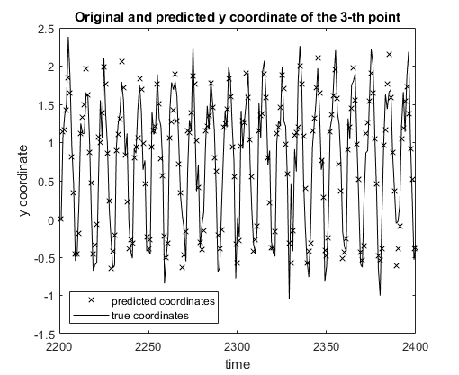

This program predicts multidimensional time-series data using a recurrent neural network (RNN)
trained by real-time recurrent learning (RTRL) with gradient clipping.

The figure below gives an example of prediction 400ms in advance with RTRL (the sampling rate is 2.5Hz). 

We used this code in the following research article: Michel Pohl, Mitsuru Uesaka, Kazuyuki Demachi, Ritu Bhusal Chhatkuli,
Prediction of the motion of chest internal points using a recurrent neural network trained with real-time recurrent learning for latency compensation in lung cancer radiotherapy,
Computerized Medical Imaging and Graphics,
Volume 91,
2021,
101941,
ISSN 0895-6111,
https://doi.org/10.1016/j.compmedimag.2021.101941.
Please consider citing that article if you use this code in your research.

Our implementation is based on the chapter 15 ("Dynamically Driven Recurrent Networks") of the following book :
Haykin, Simon S. "Neural networks and learning machines/Simon Haykin." (2009).

The main function to execute is "prediction_main.m".
The data to be predicted is in the directory "1. Input time series sequences", 
and represents the 3D motion of 3 implanted metal markers in the chest during lung cancer radiotherapy.
The markers move because of the respiratory motion and their position is sampled at approximately 2.5Hz.

The parameters concerning prediction and display should be set manually in the file "pred_par.xlsx", the function load_pred_par.m, and the file and "disp_par.xlsx".
For instance, one can choose to use training with gradient clipping or not by setting manually the field update_meth of the structure pred_par (line 28). 
The behavior of the program is controlled by the structure beh_par defined in "load_behavior_parameters.m".
In particular, one can choose to perform computations on the GPU by setting beh_par.GPU_COMPUTING = true.
The fields of this structure can be set manually.

The figures showing prediction on the test data and the loss function are saved in the folders
"1. Prediction results (figures)" and "2. Prediction results (images)". 
The RNN results are saved in the folder "3. RNN variables (temp)".
The parameters used and the numerical RNN evaluation results are also recorded in a txt file located in the folder "4. Log txt files".

Note : prediction is made without any specific assumption on the nature of the temporal data,
but the evaluation of the RNN uses the assumption that the data represents the 3D position of several objects.